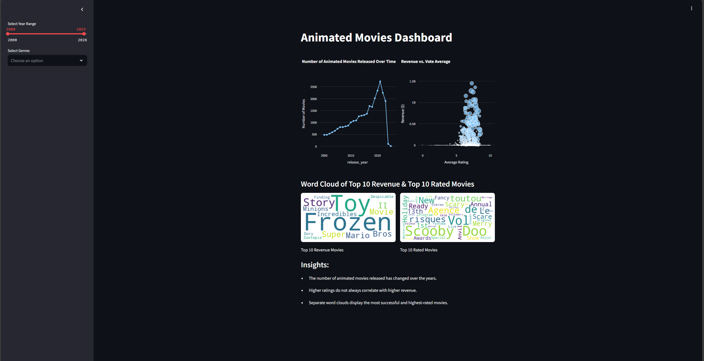

# Animated Movies Visualization Dashboard



## Overview
This is a **Streamlit dashboard** that visualizes **animated movie trends from 2000 to 2025**. It provides insights into the number of animated movies released, revenue trends, and movie ratings.

## Features
-  **Interactive Line Chart**: Displays the **number of animated movies released** over time.
-  **Bubble Chart**: Shows the **relationship between revenue and vote average**, with bubble size representing the number of votes.
-  **Bar Chart**: Provides a clearer **comparison of revenue vs. vote average** to avoid overlap issues in the bubble chart.
-  **Word Clouds**: Highlights the **top 10 highest revenue** and **top 10 highest-rated animated movies**.
-  **Yearly Word Cloud Comparison**: Compares **top 10 movies each year** based on revenue and ratings.
- **Filters**: Users can filter movies by **year range and genres** to customize visualizations.

## Installation
To run this project locally, follow these steps:

### 1️⃣ Clone the repository:
```bash
git clone https://github.com/YourUsername/YourRepo.git
cd YourRepo
```

### 2️⃣ Install dependencies:
```bash
pip install -r requirements.txt
```

### 3️⃣ Run the Streamlit app:
```bash
streamlit run streamlit_app.py
```

## Data Source
The dataset used in this project comes from Kaggle: [52,000 Animation Movie Details (2024)](https://www.kaggle.com/datasets/asaniczka/52000-animation-movie-details-dataset-2024). It contains detailed information about animated movies scraped from the TMDB API.
The dataset used in this project contains information about animated movies, including **release dates, ratings, revenue, genres, and production companies**.

## Data Cleaning
The dataset was cleaned using the following steps:
-  **Converted release dates** to datetime format and extracted release years.
-  **Filled missing values** in `vote_average`, `vote_count`, `revenue`, and `runtime` with appropriate defaults.
-  **Split genre and production company data** to handle multiple values properly.
-  **Filtered out incomplete records** where necessary to maintain data integrity.

## Future Improvements
-  **More visualizations**: Adding genre distribution trends over time.
-  **Comparison of top studios**: Analyzing revenue trends by production company.
-  **Geographic analysis**: Mapping the origin of animated movies.

## License
This project is open-source and available under the **MIT License**.

## Author
**Han Liu**


